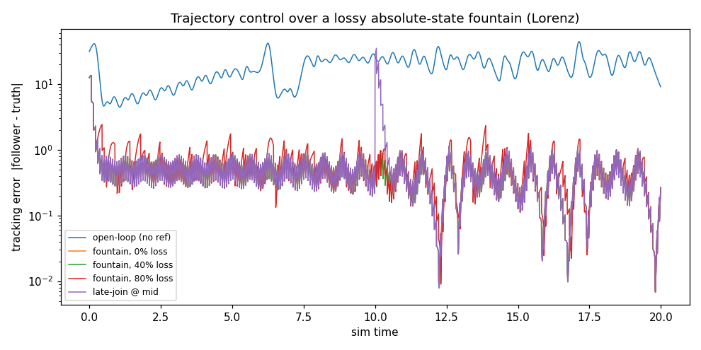

# trajectory — control by absolute-state fountain, not by a connection

A different mode from sync. A process that's **deterministic yet needs live guidance**
— a physics sim, an animation, a digital twin, a soft controller — doesn't need a
*reliable* channel. It needs the **ideal state, robustly, whenever**. So the authority
just blasts its absolute state as epoch'd [YoloFountain](../../) snapshots, and a
self-running follower reconciles toward the latest valid one.

Why a rateless code is the *ideal* transport here (not a compromise):

- **Loss is free.** The reference is *absolute*, not a delta, and the follower runs on
  its own between updates — so a missed snapshot costs nothing; the next one is the
  whole truth. No ACKs, no retransmit.
- **Late-join is free.** A follower that starts late or glitches just grabs the current
  snapshot and converges — no catch-up protocol.
- **A corrupt setpoint is worse than a missing one** — and CRC-gating means the
  follower *never* reconciles toward a torn/garbage target, which would destabilise a
  controller.

This is the **soft-state** pattern (periodic absolute refresh that self-heals). The
fountain carries the setpoint robustly; the smoothing toward it is the follower's thin
control layer — not the codec's job.

## The demo

A chaotic **Lorenz** system: the follower runs its own copy with a **3% model error**,
so open-loop it diverges exponentially — it genuinely can't run without guidance.

```bash
python applications/trajectory/demo.py       # (+ pip install matplotlib for the plot)
```

Tracking error `|follower − truth|` (steady-state), same run for every scenario:

| scenario | steady error |
|---|---|
| open-loop (no reference) | **22.6** — diverged |
| fountain, 0% loss | 0.38 |
| fountain, 40% loss | **0.38** — loss is free (redundant droplets; 99% land) |
| fountain, 80% loss | 0.48 — still locked |
| late-join (kicked to a random state mid-run) | re-converges in **0.28 sim-time** |
| 25% of frames corrupted (CRC-dropped) | 0.39 — stays locked |
| raw transport delivers the torn targets | **5.47 — destabilised** (14× worse) |



Blue is open-loop (two orders of magnitude off); the fountain-tracked lines hug the
bottom even at 80% loss; the spike at t=10 is the late-join kick, recovering in a
blink.

## The point

A self-running deterministic process needs only an **absolute reference, robustly,
whenever** — which is exactly what a rateless, connectionless, CRC-gated broadcast is.
It's the same core as [statusbus](../statusbus): a rateless absolute-state broadcast.
The only thing that changes is the consumer's role — a passive *reader* is a
status/config store; an active *tracker* is trajectory control. Build the broadcast
once; both fall out.

## Files

```
trajectory.py   Lorenz RK4 + Authority (emits snapshot frames) + Follower (reconciles)
demo.py         open-loop / fountain@0,40,80% / late-join / torn-vs-CRC, with a plot
```
